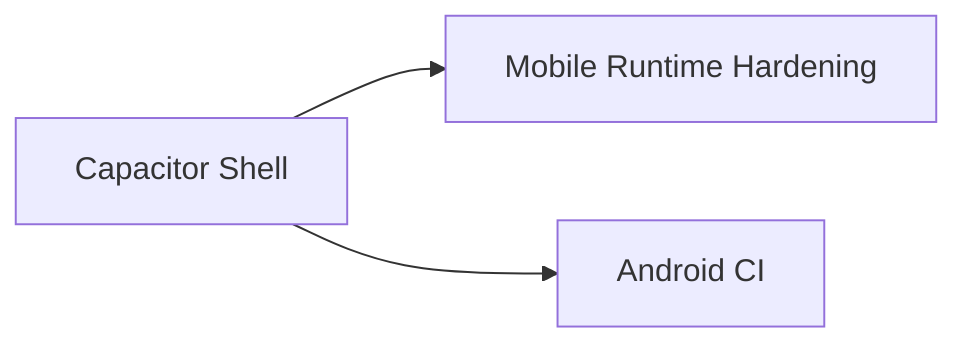

# Approach: Stage 3 - Mobile App

## Strategy
Wrap the existing web app with Ionic Capacitor to produce an Android app while keeping a single source of truth in the web client. Follow Lahilo's Android structure and build flow to avoid guesswork, then harden runtime needs (auth, storage, assets), and finish with automated Android builds.

## Partitions (Feature Branches)

### Partition 1: Capacitor Shell -> `feat/mobile-shell`
**Modules**: `apps/client`, `apps/mobile`, root `package.json`
**Scope**: Add Capacitor, generate Android project, and wire the web build output using Lahilo's Android defaults.
**Dependencies**: Stage 2 web build outputs must be stable.

#### Implementation Steps
1. Add Capacitor dependencies and init Android project.
2. Create `capacitor.config.ts` with `webDir` pointing to the web build output and set `appId`/`appName`.
3. Mirror Lahilo Android defaults in `android/app/build.gradle` and `AndroidManifest.xml` (namespace/applicationId, deep link scheme, FileProvider, INTERNET permission).
4. Add scripts for build, sync, run, and android platform regeneration (move existing `android/`, `cap add android`, restore).
5. Verify the app loads and can play a bundled game offline.

### Partition 2: Mobile Runtime Hardening -> `feat/mobile-runtime`
**Modules**: `apps/client/src`, `apps/mobile/android`
**Scope**: Mobile-specific auth, storage, and UX polish, aligned with Lahilo's Capacitor auth patterns.
**Dependencies**: Partition 1.

#### Implementation Steps
1. Mirror Lahilo's hosted UI flow using Capacitor Browser/App listeners for redirects.
2. Store auth tokens using Capacitor Preferences or Secure Storage.
3. Add native assets (icon, splash) and status bar config.
4. Validate public Peer.js config for mobile environments.

### Partition 3: Android CI -> `feat/mobile-ci`
**Modules**: `.github/workflows`, `apps/mobile`
**Scope**: GitHub Actions build pipeline for Android AABs, mirroring Lahilo's workflow.
**Dependencies**: Partition 1.

#### Implementation Steps
1. Add workflow to build signed Android AAB (Java 17, Node 20, `cap add android` regeneration, `.env` generation, `capacitor-assets`, `build:android`, `sync:android`).
2. Decrypt keystore and run `npx cap build --androidreleasetype AAB`.
3. Rename and upload the AAB artifact, document local build steps.

## Sequencing
Partition 1 is required first. Partition 2 depends on Partition 1. Partition 3 can run after Partition 1 and in parallel with Partition 2.

## Migrations & Compat
No data migration. Mobile app consumes the same bundled assets as the web build.

## Risks & Mitigations
| Risk | Mitigation |
| --- | --- |
| Capacitor build output mismatch | Pin `webDir` and keep build scripts aligned with web app build. |
| Auth flow breaks on mobile | Reuse Lahilo pattern and validate on emulator early. |
| Large APK size | Audit assets and avoid bundling unused examples. |
| Capacitor Android regen overrides | Follow Lahilo's move/regenerate/restore approach. |

## Alternatives Considered
Build a fully native client, but this would duplicate logic and slow iteration.
